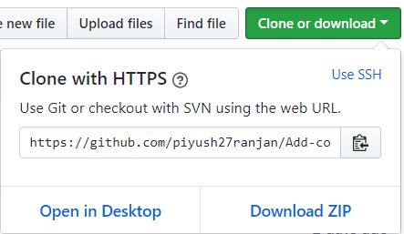

[](https://github.com/ellerbrock/open-source-badges/)
[](http://hits.dwyl.io/piyush27ranjan/Add-cover-art)
[](https://GitHub.com/piyush27ranjan/Game_Learner/graphs/commit-activity)
[](https://github.com/piyush27ranjan/Game_Learner/issues)
<br>
[](https://www.python.org/)
[](https://www.python.org/)
# Add Cover Art

If you are bored of looking at a lame cover photo while browsing through your songs which doesn't even matches the song or it is the logo of the website from where you have downloaded that mp3 file.

This application will find all the .mp3 file in your computer and automatically scrape a suitable cover from google images and apply it to the mp3 file.  

## Getting Started

These instructions will help you run this application in your local machine.

### Prerequisites

As the script is written in python, you need to download Python on your system, specifically *Python 3.x* or latest. Its installer can be downloaded from [here](https://www.python.org/downloads/).

### Installing Packages


1. Fork this repository and then clone the repository to your local system using `git clone` or extract the *downloaded zip file*.



<hr>

2. Run ***requirement.txt*** on command prompt/shell using pip

```
  pip install -r requirements.txt
```
3. Install the following modules using pip

```
  pip install python-magic-bin
```

if error related to *image* or *ImageTk* still persists, run the following commands:

```
  pip install image
````

For *Linux* systems, run the given command on shell:
```
  sudo apt-get install python3-pil.imagetk
```

## Usage and Deployment

1. Run *command prompt* or *linux shell*
2. Change directory into the directory containing the `.mp3` files
3. Run the script
 ```
  python main.py 
 ```
 4. Press **OK** Button to set the image as the cover photo and then press **Next** Button to process another .mp3 file
 5. To close the application press **Cancel** Button and the give keyboared interupt by pressing **ctrl + C**

## Sample


